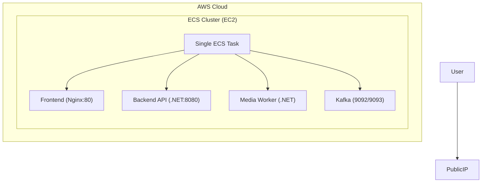

# ECS on EC2 Deployment Guide (CMS Demo)

This is a demo-only deployment that keeps the setup minimal. It runs all 4 services inside a single ECS task on one EC2 instance.

- Frontend (React + Nginx) - port 80
- Backend API (.NET 10) - port 8080
- Media Worker (.NET 10) - no inbound ports
- Kafka (Bitnami) - ports 9092/9093



## 1) Prerequisites

- AWS CLI configured with permissions for ECS, EC2, ECR, EFS, ALB, IAM, VPC, and Cloud Map.
- Docker installed locally.

For a demo, you can use:
- 1 public subnet
- 1 ECS-optimized EC2 instance (public IP)
- 1 security group (see Ports below)

### Ports and security groups

**EC2 instance / ECS task ENI (what to open to the internet):**

| Port | Protocol | Source    | Purpose                    |
|------|----------|-----------|----------------------------|
| 80   | TCP      | 0.0.0.0/0 | User access to frontend    |

Only port **80** needs to be open on the security group attached to the ECS task (or the EC2 instance if you use host networking). Backend (8080) and Kafka (9092/9093) are used only between containers on the same task over localhost; do **not** expose them publicly.

**Container ports (internal, no security group rules needed):**

| Service      | Container port(s) | Exposed to host? |
|-------------|-------------------|------------------|
| Frontend    | 80                | Yes (mapped in task) |
| Backend API | 8080              | No (localhost only)  |
| Media Worker| —                 | No (outbound only)   |
| Kafka       | 9092, 9093        | No (localhost only)  |

When using `awsvpc` networking, the task gets its own ENI. Attach a security group to that ENI with **inbound TCP 80** from the appropriate CIDR (e.g. `0.0.0.0/0` for demo). The ECS service or task definition can specify this security group.

## 2) Build and Push Images

Dockerfiles:
- `frontend/Dockerfile`
- `backend/Dockerfile`
- `backend/DemoCms.MediaWorker/Dockerfile`

```bash
aws ecr create-repository --repository-name cms-demo/frontend \
  --tags Key=Environment,Value=demo Key=Project,Value=cms-demo

aws ecr create-repository --repository-name cms-demo/backend \
  --tags Key=Environment,Value=demo Key=Project,Value=cms-demo

aws ecr create-repository --repository-name cms-demo/media-worker \
  --tags Key=Environment,Value=demo Key=Project,Value=cms-demo

aws ecr get-login-password --region <region> | docker login --username AWS --password-stdin <account>.dkr.ecr.<region>.amazonaws.com
```

**Important:** ECS EC2 uses **linux/amd64**. If you build on an ARM Mac (M1/M2), you must build for amd64 or ECS will fail with `CannotPullContainerError: no matching manifest for linux/amd64`. Use `--platform linux/amd64`:

```bash
docker build --platform linux/amd64 -t cms-demo/frontend ./frontend
docker tag cms-demo/frontend:latest <account>.dkr.ecr.<region>.amazonaws.com/cms-demo/frontend:latest
docker push <account>.dkr.ecr.<region>.amazonaws.com/cms-demo/frontend:latest

docker build --platform linux/amd64 -t cms-demo/backend ./backend
docker tag cms-demo/backend:latest <account>.dkr.ecr.<region>.amazonaws.com/cms-demo/backend:latest
docker push <account>.dkr.ecr.<region>.amazonaws.com/cms-demo/backend:latest

docker build --platform linux/amd64 -t cms-demo/media-worker ./backend/DemoCms.MediaWorker
docker tag cms-demo/media-worker:latest <account>.dkr.ecr.<region>.amazonaws.com/cms-demo/media-worker:latest
docker push <account>.dkr.ecr.<region>.amazonaws.com/cms-demo/media-worker:latest
```

## 3) ECS Cluster (EC2)

Create an ECS cluster:

```bash
aws ecs create-cluster --cluster-name cms-demo-cluster
```

Launch a single ECS-optimized EC2 instance (public subnet) with this user data:

```bash
#!/bin/bash
echo ECS_CLUSTER=cms-demo-cluster >> /etc/ecs/ecs.config
```

Make sure the instance role includes `AmazonEC2ContainerServiceforEC2Role`.

## 4) IAM Roles

- **Task execution role**: `AmazonECSTaskExecutionRolePolicy`
- **Task role**: CloudWatch Logs (optional: SSM Parameter Store for secrets)

## 5) Demo Task Definition (single task, 4 containers)

For simplicity, run all containers in one task definition. The frontend Nginx config supports both ECS and k8s via `BACKEND_HOST`.

### Where to set environment variables

All of the following env vars are set in the **ECS Task Definition**, in the **`containerDefinitions`** array, per container:

- **AWS Console:** ECS → Task Definitions → Create / Edit → each container → **Environment variables** (key/value).
- **AWS CLI / CloudFormation:** In the task definition JSON, under `containerDefinitions[].environment` as a list of `{ "name": "...", "value": "..." }`.

Optional: store secrets in **AWS Systems Manager Parameter Store** or **Secrets Manager**, then in the task definition use `valueFrom` with `arn:aws:ssm:...` or `arn:aws:secretsmanager:...` instead of `value`. The task execution role needs `ssm:GetParameters` or `secretsmanager:GetSecretValue` as appropriate.

Summary of which container gets which env vars:

| Container       | Main env vars (see sections below)        |
|----------------|-------------------------------------------|
| frontend       | `BACKEND_HOST=localhost:8080`             |
| backend        | ASPNETCORE_*, ConnectionStrings, Storage, MediaEvents |
| media-worker   | Kafka__*, OpenAI__*, Api__BaseUrl         |
| kafka          | KAFKA_CFG_*, KAFKA_KRAFT_*, ALLOW_PLAINTEXT_LISTENER |

Use host volumes for persistence (demo-only):
- `/app/uploads`
- `/app/data`
- `/bitnami/kafka`

### Backend API

Environment variables from `k8s/backend-deployment.yaml`:
- `ASPNETCORE_ENVIRONMENT=Production`
- `ASPNETCORE_URLS=http://+:8080`
- `ConnectionStrings__DefaultConnection=Data Source=/app/data/media.db`
- `Storage__Path=/app/uploads`
- `MediaEvents__Enabled=true`
- `MediaEvents__BootstrapServers=localhost:9092`
- `MediaEvents__Topic=media.uploaded`
- `MediaEvents__PublicBaseUrl=http://localhost:8080`

**Host volume mounts (backend container):**

| Container path | Purpose | Backend env that uses it |
|----------------|---------|---------------------------|
| `/app/uploads` | Uploaded media files | `Storage__Path=/app/uploads` |
| `/app/data`    | SQLite database file  | `ConnectionStrings__DefaultConnection=Data Source=/app/data/media.db` |

Configure in the **task definition**:

1. **Volumes** (task-level): define two `host` volumes with `sourcePath` set to paths on the EC2 instance, e.g. `/data/cms-demo/uploads` and `/data/cms-demo/data`.
2. **Mount points** (backend container): add two `mountPoints` mapping those volume names to `containerPath` `/app/uploads` and `/app/data`.

Ensure the host directories exist and are writable by the task. On the ECS EC2 instance you can create them in user data, e.g.:

```bash
mkdir -p /data/cms-demo/uploads /data/cms-demo/data
chown -R 1000:1000 /data/cms-demo
```

Example task definition snippet (volumes + backend mountPoints):

```json
"volumes": [
  { "name": "backend-uploads", "host": { "sourcePath": "/data/cms-demo/uploads" } },
  { "name": "backend-data",   "host": { "sourcePath": "/data/cms-demo/data" } }
],
"containerDefinitions": [
  {
    "name": "backend",
    "mountPoints": [
      { "sourceVolume": "backend-uploads", "containerPath": "/app/uploads" },
      { "sourceVolume": "backend-data",    "containerPath": "/app/data" }
    ]
  }
]
```

Host volumes are tied to a single instance; data is lost if the task moves to another host. For production or multi-AZ, use EFS (or another shared storage) instead of `host` volumes.

### Frontend

Set in the **task definition** for the frontend container:

- `BACKEND_HOST=localhost:8080` — so Nginx proxies `/api/*` to the backend in the same task. When unset (e.g. in k8s), Nginx defaults to `backend:8080`.

The image build sets `REACT_APP_API_URL=`; Nginx proxies `/api/*` at runtime using `BACKEND_HOST`. No other frontend env vars are required for ECS.

### Media Worker

Environment variables from `k8s/media-worker-deployment.yaml`:
- `Kafka__BootstrapServers=localhost:9092`
- `Kafka__Topic=media.uploaded`
- `Kafka__GroupId=demo-cms-media-worker`
- `Kafka__AutoOffsetReset=Earliest`
- `Kafka__EnableAutoCommit=false`
- `OpenAI__BaseUrl=http://llama:11434/v1`
- `OpenAI__ApiKey=ollama`
- `OpenAI__Model=llama3.2-vision`
- `OpenAI__Prompt=Describe the image in one sentence.`
- `Api__BaseUrl=http://localhost:8080`

### Kafka

Environment variables from `k8s/kafka-deployment.yaml`:
- `KAFKA_CFG_NODE_ID=1`
- `KAFKA_CFG_PROCESS_ROLES=broker,controller`
- `KAFKA_CFG_LISTENERS=PLAINTEXT://:9092,CONTROLLER://:9093`
- `KAFKA_CFG_ADVERTISED_LISTENERS=PLAINTEXT://kafka:9092`
- `KAFKA_CFG_LISTENER_SECURITY_PROTOCOL_MAP=CONTROLLER:PLAINTEXT,PLAINTEXT:PLAINTEXT`
- `KAFKA_CFG_CONTROLLER_LISTENER_NAMES=CONTROLLER`
- `KAFKA_CFG_CONTROLLER_QUORUM_VOTERS=1@kafka:9093`
- `KAFKA_CFG_AUTO_CREATE_TOPICS_ENABLE=true`
- `KAFKA_KRAFT_CLUSTER_ID=q1Sh-9_ISia_zwGINzR_GA`
- `ALLOW_PLAINTEXT_LISTENER=yes`

Mount host volume `/bitnami/kafka`.

## 6) Create ECS Service

Create a single ECS service from the task definition:

- **Networking:** `awsvpc` (so the task gets its own ENI and you can assign a public IP).
- **Subnets:** Use a **public** subnet so the task can get a public IP.
- **Public IP:** Enable **Assign public IP** for the service (or for the subnet’s auto-assign).
- **Security group:** Attach a security group that allows **inbound TCP 80** (e.g. from `0.0.0.0/0` for demo). No need to open 8080, 9092, or 9093 — those are only for container-to-container on the same task.

## 7) Verify

```bash
aws ecs describe-services --cluster cms-demo-cluster --services cms-demo
aws ecs list-tasks --cluster cms-demo-cluster --service-name cms-demo

curl http://<task-public-ip>/
curl http://<task-public-ip>/api/media
```

## 8) Optional: OpenTelemetry and Llama

### OpenTelemetry (OTEL) env variables

Set these only if you run an OTLP collector (e.g. OpenTelemetry Collector, Coralogix agent) that your tasks can reach. If you don’t set `OpenTelemetry__OtlpEndpoint`, the apps still run; they just won’t export traces/metrics.

**Backend API** (task definition → backend container):

| Name | Example value | Notes |
|------|----------------|--------|
| `OpenTelemetry__OtlpEndpoint` | `http://<collector-host>:4318` | OTLP HTTP endpoint (traces + metrics) |
| `OpenTelemetry__EnableOtlpExporter` | `true` | Optional; default in app is `true` |
| `OpenTelemetry__ServiceName` | `demo-cms-api` | Optional; default `demo-cms-api` |
| `OpenTelemetry__ServiceVersion` | `1.0.0` | Optional |

**Media Worker** (task definition → media-worker container):

| Name | Example value | Notes |
|------|----------------|--------|
| `OpenTelemetry__OtlpEndpoint` | `http://<collector-host>:4318` | Same collector as backend |
| `OpenTelemetry__EnableOtlpExporter` | `true` | Optional |
| `OpenTelemetry__ServiceName` | `demo-cms-media-worker` | Optional |
| `OpenTelemetry__ServiceVersion` | `1.0.0` | Optional |

**Frontend:** The React app sends browser traces to an endpoint that is currently hardcoded or injected at runtime (e.g. `window.APP_CONFIG`). There is no ECS env var that the frontend container reads for OTEL; if you need to point the browser at your collector, configure that via your frontend build or a runtime-injected config (e.g. nginx substituting a script). For ECS-only demo you can leave frontend OTEL as-is.

**Where to set:** Task definition → each container’s **Environment variables**. Use the same collector URL for backend and media-worker (e.g. an OTEL Collector or Coralogix agent running in another ECS task or on the same host). If the collector runs on the same EC2 instance as the task, you can use the host’s IP (e.g. from user data or a sidecar) or `localhost` only if the collector is in the same task.

### Llama/Ollama

The media worker uses `OpenAI__BaseUrl` (and related `OpenAI__*` vars). Set these in the **task definition** for the media-worker container. Point to an Ollama instance (e.g. another task or an external URL) or deploy Llama separately and set the env var to that endpoint.
