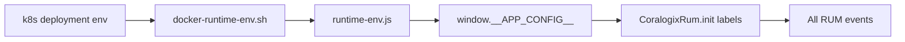

# ADR-011: Coralogix RUM `organization_name` Label on All Events

**Status**: Proposed  
**Date**: 2026-05-29

## Context

Workshop and multi-tenant DataPrime queries need a stable **organization cohort dimension** on every Coralogix Browser SDK RUM event from both frontends in `cms_demo`:

| Frontend | RUM stack today |
|---|---|
| `canvas-frontend` | Full stack: `CoralogixRum.init({ labels })` + `rumBeforeSend` → `enrichSessionLabels` for session-dynamic labels |
| `frontend` (CMS) | Minimal: `CoralogixRum.init({ labels: { subsystem } })` + `beforeSend` URL redaction only |

Labels are sourced from `window.__APP_CONFIG__`, populated at container start by `docker-runtime-env.sh` from env vars (k8s deployment env → nginx entrypoint → `runtime-env.js`).

**Requirement**: Add `organization_name` to **all** RUM events (page views, network, errors, custom logs, measurements). Value may be fictional/demo; must be overridable per deployment without code change.

**Constraint**: `organization_name` is **deployment-static** — it does not change during a browser session and is not derived from URL params or runtime state (unlike ADR-008 session labels).

## Evaluation Criteria

| Characteristic | Priority | Notes |
|---|---|---|
| Observability | High | Filter/group all RUM telemetry by org in DataPrime |
| Maintainability | High | Same config pattern as `CORALOGIX_SUBSYSTEM`; no duplicate injection paths |
| Deployability | High | k8s env + docker entrypoint; works locally without env |
| Testability | Medium | Unit tests on init options; no Playwright required |
| Security | Low | Fictional name only; no PII |

### Option scoring (1–5)

| Characteristic | A. Init labels only | B. beforeSend only | C. Both init + beforeSend |
|---|---|---|---|
| Observability | 5 | 5 | 5 |
| Maintainability | 5 | 3 | 2 |
| Deployability | 5 | 4 | 4 |
| Testability | 5 | 4 | 3 |
| **Total** | **20** | **16** | **14** |

## Options Considered

| Option | Pros | Cons |
|---|---|---|
| A. **Init labels only** | Matches `subsystem`; SDK attaches to every event type; single source of truth | Canvas `beforeSend` tests must assert init separately from session labels |
| B. beforeSend only | Canvas already has enrichment pipeline | CMS has no label pipeline; would require new module or inline hook for parity |
| C. Both init + beforeSend | Belt-and-suspenders | Redundant; drift risk if one path updated (Single-Knob Illusion) |

### Config source options

| Option | Pros | Cons |
|---|---|---|
| Hardcoded in TS | Zero wiring | Not overridable per k8s cluster/demo tenant |
| **Env var + code default** | Matches existing `CORALOGIX_*` pattern; local dev works OOTB | Two default locations (TS + shell) must stay in sync |
| URL query param | Per-session org switching | Wrong abstraction; org is deploy identity not session state |

## Decision

### 1. Label placement: **init labels only (Option A)**

Set `organization_name` in `CoralogixRum.init({ labels: { …, organization_name } })` in **both** frontends.

**Do not** add to `rumBeforeSend.enrichSessionLabels` or CMS `beforeSend`.

**Rationale**:

- Coralogix Browser SDK session init labels are merged onto **every** emitted event (automatic instrumentation, `rumLog`, `captureError`, custom measurements).
- ADR-008 reserved `beforeSend` for **session-dynamic** labels (widget count, collaboration, network type). `organization_name` is **deploy-static**, same class as `subsystem`.
- CMS frontend has no label context module; init-only keeps parity without new infrastructure.

### 2. Config source: **env var with shared default**

| Layer | Key | Default |
|---|---|---|
| Runtime config (`__APP_CONFIG__`) | `CORALOGIX_ORGANIZATION_NAME` | — |
| TypeScript resolver | `config.CORALOGIX_ORGANIZATION_NAME \|\| DEFAULT_ORGANIZATION_NAME` | **`Acme Digital Works`** |
| `docker-runtime-env.sh` | `CORALOGIX_ORGANIZATION_NAME` | **`Acme Digital Works`** |

**Default name**: **`Acme Digital Works`** — clearly fictional, human-readable in dashboards, distinct from `application: cms-demo`.

**Resolver rules** (mirror `readRuntimeValue` for public key):

- Trim whitespace.
- Treat empty string and unresolved `${CORALOGIX_ORGANIZATION_NAME}` placeholder as absent → fall back to default.
- Do **not** omit the label when absent; always emit `organization_name` (required label, never silent discard).

### 3. Cross-cutting enforcement layers

| Concern | Enforcement layer | On mismatch |
|---|---|---|
| Env → runtime JS | `docker-runtime-env.sh` jq export | Missing env → shell default `Acme Digital Works` |
| Runtime JS → SDK | `initializeCoralogixRum` init `labels` | TS fallback `Acme Digital Works` |
| k8s explicit value | Deployment env (optional) | Overrides shell default when set |
| Session labels (canvas) | `rumBeforeSend` | **Does not** set `organization_name` — out of scope |

Both TS and shell defaults must match to avoid "works in Docker, different in Jest" surprises.

## Implications

- **Positive**: Single DataPrime filter `labels.organization_name:"Acme Digital Works"` spans CMS + canvas RUM. k8s can override org per demo cluster.
- **Negative / Risks**: Label cardinality is 1 per deployment (negligible). If future multi-org **in-session** switching is needed, revisit with URL param + beforeSend (new ADR).
- **Follow-up actions**: Implement per file checklist below; add DataPrime example to workshop docs (optional).

## Implementation checklist

### Shared pattern (both frontends)

```typescript
const DEFAULT_ORGANIZATION_NAME = 'Acme Digital Works';

function resolveOrganizationName(config: RuntimeAppConfig): string {
  const value = readRuntimeValue(config.CORALOGIX_ORGANIZATION_NAME);
  return value || DEFAULT_ORGANIZATION_NAME;
}

// In CoralogixRum.init labels:
labels: {
  subsystem: ...,
  organization_name: resolveOrganizationName(config),
  ...
}
```

### Files to change

| File | Change |
|---|---|
| `canvas-frontend/src/observability/coralogixRum.ts` | Add `CORALOGIX_ORGANIZATION_NAME?` to `RuntimeAppConfig`; add resolver; set init label |
| `canvas-frontend/public/runtime-env.template.js` | Add `CORALOGIX_ORGANIZATION_NAME: "${CORALOGIX_ORGANIZATION_NAME}"` |
| `canvas-frontend/docker-runtime-env.sh` | Add `--arg CORALOGIX_ORGANIZATION_NAME "${CORALOGIX_ORGANIZATION_NAME:-Acme Digital Works}"` + jq field |
| `canvas-frontend/src/observability/coralogixRum.test.ts` | Assert init `labels.organization_name`; test default + override |
| `frontend/src/observability/coralogixRum.ts` | Same as canvas (no beforeSend change) |
| `frontend/public/runtime-env.template.js` | Same template entry |
| `frontend/docker-runtime-env.sh` | Same shell default |
| `frontend/src/observability/coralogixRum.test.ts` | Assert init label + default + override |
| `k8s/canvas-frontend-deployment.yaml` | Optional explicit `CORALOGIX_ORGANIZATION_NAME: "Acme Digital Works"` |
| `k8s/frontend-deployment.yaml` | Optional explicit env (same value) |

**Out of scope**: `rumBeforeSend.ts`, `rumLabelContext.ts`, loadgen URL params, backend services, Coralogix ingest pipeline rules.

### Test updates

| Test file | Assertion |
|---|---|
| `canvas-frontend/.../coralogixRum.test.ts` | `init` called with `labels.organization_name: 'Acme Digital Works'` when config omits key |
| `canvas-frontend/.../coralogixRum.test.ts` | Override: `CORALOGIX_ORGANIZATION_NAME: 'Northwind Studio'` → init label matches |
| `canvas-frontend/.../coralogixRum.test.ts` | Unresolved placeholder `${CORALOGIX_ORGANIZATION_NAME}` → default |
| `frontend/.../coralogixRum.test.ts` | Same three cases |
| `rumBeforeSend.test.ts` | **No change** — org label not in beforeSend pipeline |

**Fitness function**: `npm test` in `canvas-frontend` and `frontend` — all `coralogixRum` tests pass with `organization_name` assertions.

### k8s / runtime-env wiring



1. **Required**: Update both `docker-runtime-env.sh` scripts with default.
2. **Required**: Update both `runtime-env.template.js` for local/webpack dev parity.
3. **Recommended**: Add env to k8s deployments for explicit demo documentation (value inherits shell default if omitted).
4. **Not required**: `k8s/deploy.sh` changes — no special deploy logic for this var.

Local dev without Docker: `frontend/public/runtime-env.js` / `canvas-frontend/public/runtime-env.js` may omit key; TS default applies.

## Consultation

ADR-008 (session labels — orthogonal), `coralogixRum.ts` (both frontends), `docker-runtime-env.sh`, k8s frontend deployments, Coralogix Browser SDK init `labels` behavior.
