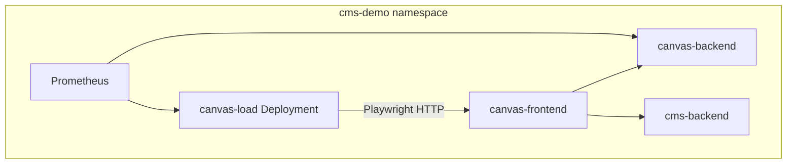

# Canvas Load Testing Architecture

## Goal

Repeatable synthetic load against **canvas-frontend** (real browsers), exercising SPA → nginx → canvas-backend → SQLite (+ CMS for media).

## Topology

Playwright E2E (`M06`) remains acceptance; load generator complements with sustained multi-user simulation.

## Fitness functions

| ID | Assertion |
|---|---|
| LF-01 | Smoke 5 users, 60s, errorRate < 0.05 |
| LF-02 | Cross-tab shape sync < 500ms under load |
| LF-03 | Cleanup removes `loadgen*` boards |
| LF-04 | Chaos does not restart canvas-backend pod |
| LF-05 | Pause drains contexts within 30s |
| LF-06 | Ramp 5→15 users within ramp_up + 5s |

## Work milestone

| Field | Value |
|---|---|
| Slug | `M09-canvas-load-generator` |
| Path | `work/milestones/M09-canvas-load-generator/README.md` |
| Depends on | `M08-canvas-app-separation` (done) |

## Related specs

- [ADR-002](../adr/ADR-002-canvas-synthetic-load-generator.md)
- [Canvas Load Generator (browser)](../components/canvas-load-generator-browser.md)
- [Whiteboard API](../components/whiteboard-api.md)
