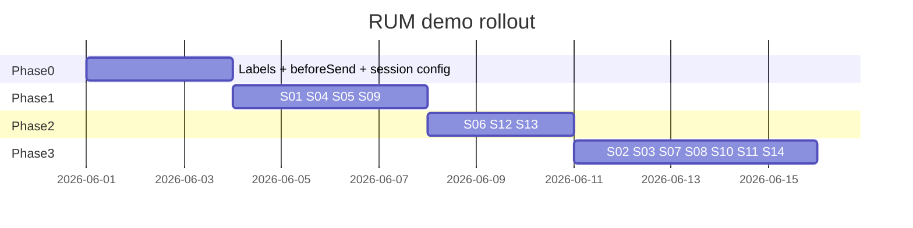

# Canvas Coralogix RUM Demo — Architecture Overview

Last updated: 2026-05-29

## System context

```mermaid
flowchart TB
  subgraph clients [Clients]
    Browser[Browser + RUM SDK]
    Panel[Rum Demo Panel]
    Loadgen[canvas-load Playwright]
  end

  subgraph fe [canvas-frontend]
    Session[rumSessionConfig]
    Registry[rumScenarios registry]
    BeforeSend[rumBeforeSend pipeline]
    Lag[canvasLagSim ADR-004]
    Meas[measurementService]
    Journey[rumJourney events]
  end

  subgraph be [canvas-backend optional]
    DemoMw[RumDemoMiddleware]
    API[/api/boards/*]
    Hub[/hubs/board]
  end

  subgraph cx [Coralogix]
    RUM[(cx_rum logs)]
  end

  Loadgen -->|"?plan&v&scenario"| Browser
  Panel --> Session
  Browser --> Session
  Session --> Registry
  Registry --> Lag
  Registry --> Journey
  Registry --> Meas
  Session --> BeforeSend
  Meas --> BeforeSend
  BeforeSend --> RUM
  Browser -->|fetch + trace headers| DemoMw
  DemoMw --> API
  Browser --> Hub
```

## Top architectural characteristics

| Characteristic | Justification |
|---|---|
| **Observability** | Demo value is queryable RUM; stable labels and scenario id on every event |
| **Testability** | Registry units + loadgen matrix; no manual-only demos |
| **Safety** | Dual gate: `rumDemo` + env `RUM_DEMO_ENABLED` + prod `ALLOW_PROD` |
| **Maintainability** | Single registry vs 14 UI code paths |
| **Performance** | S04 noise and `widgetCount` updates throttled to protect ingest cardinality |

## Implementation phasing



## Data flow: session boot

1. `runtime-env.js` loads `__APP_CONFIG__`.
2. `parseRumSessionConfig()` reads URL → merges panel storage → runtime.
3. `initializeCoralogixRum` sets `version`, static labels, `beforeSend` pipeline.
4. `activateScenario(id)` registers timers, lag sim, journey scripts; returns teardown on navigation.

## Journey events (ADR-010)

Miro-style `miro.*` custom logs are emitted only via `rumJourney/journeyEvents.ts`. Production hooks: board load (`WhiteboardPage`, `CanvasSurface`), hub (`boardHubClient`). Demo-only: extended AI steps (S11), signup/checkout script (S15 / panel). See [Canvas RUM Journey Events](../components/canvas-rum-journey-events.md).
5. Whiteboard loads → `widgetCount` label refreshed → journey `fullyInteractive` (unless S02).

## Data flow: headless batch (UC1 example)

1. `rum-batch.yaml` defines 50× `{ scenario: s01, plan: free, v: 1.95821 }`.
2. Each `VirtualBrowserUser` computes query string from `userIndex`.
3. `openBoardSession` navigates with full query; RUM session starts in real browser context.
4. Scenario S01 fires errors during `boardSession` behavior loop.
5. DataPrime: filter `rum_scenario=s01`, count distinct `cx_rum.session_context.session_id`.

## Trace correlation (S08)

| Layer | Responsibility |
|---|---|
| `rumTracing.ts` | Generate `traceparent`; mirror as `sentry-trace` for workshop narrative |
| `whiteboardApi` / `boardHubClient` | Attach headers on outbound requests |
| `rumBeforeSend` | On `network_request` events, parse response/request headers → `labels.trace_id` |
| Coralogix UI | Join RUM ↔ APM via trace id (when backend OTLP added later) |

## Test strategy

### Unit (Jest, `canvas-frontend`)

| Module | Cases |
|---|---|
| `rumSessionConfig` | URL parsing, defaults, override order, `buildSessionQuery` round-trip |
| `rumBeforeSend` | Labels merged; URLs redacted; trace id extraction; drop counter |
| `rumScenarios/registry` | Each scenario `activate`/`teardown` without throw; unknown id |
| `rumTracing` | Valid W3C `traceparent` format |
| `coralogixRum` | init receives `version` from session; pipeline invoked |

### Integration (FE)

- Mock `@coralogix/browser`: assert `beforeSend` called with `labels.plan=enterprise`.
- MSW or fetch mock: S06 header present when scenario active.

### E2E (Playwright, `canvas-frontend/tests/e2e`)

- `?rumDemo=1&scenario=s05`: panel visible, `data-testid` scenario active.
- S02: navigate away before canvas ready → no `fullyInteractive` log in window test hook `__RUM_JOURNEY_LOG__`.

### Loadgen

- `config/rum-batch.yaml` smoke: 5 users, 2 scenarios, exit 0.
- Metric `canvas_load_rum_sessions_total` matches matrix sum.

### RUM validation (DataPrime, extend `docs/canvas-perf-rum-validation.md`)

Per-scenario sections with copy-paste queries filtering `$d.cx_rum.labels.rum_scenario == 's01'` etc.

### CI gates

| Gate | Command |
|---|---|
| Unit | `cd canvas-frontend && npm test -- --testPathPattern=observability` |
| Loadgen smoke | `cd loadgen/canvas-load && npm test` + optional `rum-batch` dry-run |
| No prod demo | lint: `RUM_DEMO_ENABLED` not true in `k8s/canvas-frontend-deployment.yaml` unless documented patch |

## Related decisions

- [ADR-004: Canvas Lag Simulation](../adr/ADR-004-canvas-lag-simulation.md) — S07, S10, S12
- [ADR-005: RUM Demo Scenarios](../adr/ADR-005-coralogix-rum-demo-scenarios.md)
- [Canvas Lag Simulator](../components/canvas-lag-simulator.md)
