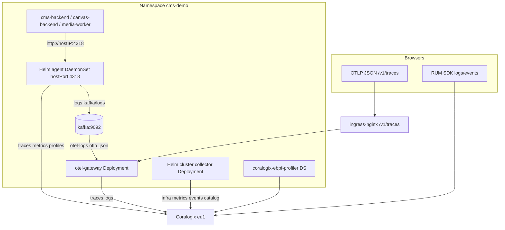

# Coralogix OTEL: k8s-raw → Helm Migration Plan

Last updated: 2026-06-18

## System context



| Path | Source | Destination |
|---|---|---|
| Server APM | `k8s/backend-deployment.yaml`, `canvas-backend-deployment.yaml`, `media-worker-deployment.yaml` | Node agent hostPort → Coralogix |
| Browser traces | `k8s/ingress.yaml` | `otel-gateway` → Coralogix |
| Container logs (Kafka path) | Helm agent | `otel-logs` → gateway → Coralogix |
| Infrastructure Explorer | Helm cluster collector | Coralogix resource catalog |

## 1. Migration sequence

Execute in order. Do not run Helm install while k8s-raw resources still own the same names.

### Phase 0 — Prerequisites

```bash
# Namespace + secret (if not present)
kubectl apply -f k8s/namespace.yaml
kubectl get secret coralogix-keys -n cms-demo   # key: PRIVATE_KEY

# App stack including Kafka (agent log export depends on it)
./k8s/deploy.sh --skip-build --no-images

# Apply otel-gateway (NOT in k8s/kustomization.yaml today — apply explicitly until fixed)
kubectl apply -f k8s/otel-gateway-config.yaml \
               -f k8s/otel-gateway-deployment.yaml \
               -f k8s/otel-gateway-service.yaml
```

### Phase 1 — Remove k8s-raw

```bash
kubectl delete -k coralogix/k8s-raw/ --ignore-not-found

# Confirm cluster-scoped RBAC released (same names Helm reuses)
kubectl get clusterrole,clusterrolebinding | grep coralogix-opentelemetry
kubectl get deploy,ds,svc -n cms-demo | grep coralogix-opentelemetry
```

Expected removal: `coralogix-opentelemetry-collector` Deployment, `coralogix-opentelemetry-agent` DaemonSet, Services `coralogix-opentelemetry-collector` and `otel-agent` (raw selectors), ConfigMaps, ServiceAccounts, ClusterRoles/Bindings.

**Gap window**: server and infra telemetry pauses until Phase 2 completes. Browser RUM logs unaffected; `/v1/traces` unaffected if gateway still running.

### Phase 2 — Install Helm

```bash
helm repo add coralogix https://cgx.jfrog.io/artifactory/coralogix-charts-virtual
helm repo update

# Dry-run first (Docker Desktop: always use post-renderer)
helm template otel-coralogix-integration coralogix/otel-integration \
  -n cms-demo -f coralogix/values.yaml \
  --post-renderer coralogix/post-renderer.sh \
  | grep -E 'hostPort|mountPropagation|name: otel-agent'

helm upgrade --install otel-coralogix-integration coralogix/otel-integration \
  -n cms-demo -f coralogix/values.yaml \
  --post-renderer coralogix/post-renderer.sh \
  --wait --timeout 10m
```

### Phase 3 — Reconcile k8s app manifests

```bash
# otel-agent Service must match Helm labels (already correct in repo)
kubectl apply -f k8s/otel-agent-service.yaml

# Restart app pods so OTLP clients reconnect after agent rollout
kubectl rollout restart deployment/cms-backend deployment/canvas-backend deployment/media-worker -n cms-demo
kubectl rollout status deployment/cms-backend deployment/canvas-backend deployment/media-worker -n cms-demo
```

### Phase 4 — Post-migration values hardening (before deleting k8s-raw from repo)

| Check | Action if failing |
|---|---|
| No `hostPort: 4318` in rendered agent DaemonSet | Add agent port overrides to `coralogix/values.yaml`; re-run Phase 2 |
| Helm creates `otel-gateway` or duplicate gateway | Set `opentelemetry-gateway.enabled: false` in `values.yaml` |
| Agent logs not reaching Coralogix | Verify Kafka up; topic `otel-logs`; gateway pod consuming |
| mountPropagation errors on Docker Desktop | Confirm `post-renderer.sh` used on every helm command |

## 2. Resource conflicts and resolution

| Resource | k8s-raw | Helm / k8s app | Conflict | Resolution |
|---|---|---|---|---|
| DaemonSet `coralogix-opentelemetry-agent` | `app.kubernetes.io/instance: coralogix-otel-raw` | `otel-coralogix-integration` | Same metadata.name | Delete raw before `helm install` |
| Deployment `coralogix-opentelemetry-collector` | raw instance label | Helm cluster collector | Same metadata.name | Delete raw first |
| Service `otel-agent` | Selector: `coralogix-otel-raw` | `k8s/otel-agent-service.yaml` selects `otel-coralogix-integration` | Same Service name, different selectors | Delete raw Service; keep `k8s/otel-agent-service.yaml` |
| Service `coralogix-opentelemetry-collector` | raw | Helm | Same name | Delete raw first |
| ClusterRole `coralogix-opentelemetry-collector` | raw labels | Helm | Same cluster-scoped name | `kubectl delete -k` removes bindings |
| ClusterRole `coralogix-opentelemetry-agent` | raw | Helm | Same name | Delete raw first |
| ServiceAccount `coralogix-opentelemetry` / `...-collector` | raw | Helm | Same names in `cms-demo` | Delete raw first |
| Service `otel-gateway` | — | `k8s/otel-gateway-service.yaml` | Helm `opentelemetry-gateway` subchart may add gateway | Disable Helm gateway or rename; keep k8s gateway for ingress |
| eBPF profiler DS | Not in raw | `coralogix-ebpf-profiler` from Helm | N/A on migration to Helm | Helm creates it; no raw duplicate |
| Integration label in Coralogix | `coralogix-integration-k8s-raw` | `coralogix-integration-helm` | UI filter only | Expect label change in Infrastructure Explorer |

**Release name contract**: `k8s/otel-agent-service.yaml` hard-codes `app.kubernetes.io/instance: otel-coralogix-integration`. Do not change release name without updating that file.

## 3. Repo cleanup (after verification)

### Delete entirely

```
coralogix/k8s-raw/
├── 01-serviceaccounts.yaml … 08-services.yaml
├── config/agent-relay.yaml
├── config/collector-relay.yaml
├── kustomization.yaml
└── README.md
```

### Keep

| Path | Reason |
|---|---|
| `coralogix/values.yaml` | Helm source of truth |
| `coralogix/post-renderer.sh` | Docker Desktop mountPropagation fix |
| `coralogix/rendered_configs/` | Diff baseline after `helm template` (regenerate) |
| `coralogix/sgi_coralogix.yml` | Reference values for other environments |
| `k8s/otel-agent-service.yaml` | Helm-aligned ClusterIP service |
| `k8s/otel-gateway-*.yaml` | Browser traces + Kafka log consumer (ADR-013) |

### Fix in repo (implementation follow-up, not spec)

- Add `otel-gateway-config.yaml`, `otel-gateway-deployment.yaml`, `otel-gateway-service.yaml` to `k8s/kustomization.yaml`
- Add `coralogix/README.md` with Helm install/upgrade/rollback (replace deleted k8s-raw README content inverted)

## 4. Documentation updates

| File | Change |
|---|---|
| `README.md` (root) | Replace `coralogix-agent` chart name with `otel-integration` release `otel-coralogix-integration`; document post-renderer; remove k8s-raw references |
| `k8s/README.md` | Fix stale `http://otel-collector:4318` → `http://$(NODE):4318` via node agent hostPort; add Helm prerequisite section pointing to `coralogix/values.yaml` |
| `coralogix/k8s-raw/README.md` | Delete; superseded by `coralogix/README.md` |
| `spec/components/canvas-backend-otel.md` | K8s column already documents `http://$(NODE):4318`; add note that agent comes from Helm release |
| `spec/components/cms-frontend-rum-tracing.md` | Confirm gateway deploy step in k8s doc |
| `spec/adr/ADR-013-cms-frontend-rum-span-export.md` | No change to decision; gateway remains k8s-managed |
| `CLAUDE.md` | If observability section mentions raw manifests, point to Helm |

## 5. Verification steps

### Cluster health

```bash
kubectl -n cms-demo get pods -l app.kubernetes.io/instance=otel-coralogix-integration
kubectl -n cms-demo rollout status ds/coralogix-opentelemetry-agent
kubectl -n cms-demo rollout status deploy/coralogix-opentelemetry-collector
kubectl -n cms-demo get svc otel-agent otel-gateway -o wide
kubectl -n cms-demo get endpoints otel-agent   # must show agent pod IPs
```

### hostPort / backend export

```bash
# From any app pod: node IP should accept OTLP HTTP
kubectl -n cms-demo exec deploy/cms-backend -- sh -c \
  'wget -qO- --timeout=2 http://${NODE}:4318/v1/traces 2>&1 | head -1'
# Expect connection (405/404 acceptable); connection refused = hostPort broken

kubectl -n cms-demo logs deploy/cms-backend --tail=30 | grep -i otel
kubectl -n cms-demo logs ds/coralogix-opentelemetry-agent --tail=50 | grep -iE 'error|export'
```

### Browser trace path

```bash
curl -s -o /dev/null -w '%{http_code}' -X POST http://localhost/v1/traces \
  -H 'Content-Type: application/json' -d '{"resourceSpans":[]}'
# Expect 200/400 from collector, not 502
```

### Kafka log pipeline

```bash
kubectl -n cms-demo get pods -l app=kafka
kubectl -n cms-demo logs deploy/otel-gateway --tail=30 | grep -i kafka
# Trigger app log; confirm appearance in Coralogix Logs (application otel / subsystem gateway)
```

### Coralogix UI (manual, ~2–5 min lag)

- Infrastructure Explorer: cluster `cms-demo-cluster`, nodes, workloads
- APM: spans from `demo-cms-api`, `demo-canvas-api`, media-worker
- Traces: browser spans via gateway subsystem
- Profiles: eBPF / agent profiles if enabled

### Config validation (CI-friendly)

```bash
helm template otel-coralogix-integration coralogix/otel-integration \
  -n cms-demo -f coralogix/values.yaml \
  --post-renderer coralogix/post-renderer.sh > /tmp/helm-otel.yaml

# Optional: extract agent config and validate with otelcol-contrib image
grep -q 'mountPropagation: None' /tmp/helm-otel.yaml && echo OK post-render
```

## 6. Risks and mitigations

| Risk | Impact | Mitigation |
|---|---|---|
| **Docker Desktop hostPath** | Agent/collector CrashLoop on `mountPropagation: HostToContainer` | Always pass `--post-renderer coralogix/post-renderer.sh`; CI gate on rendered manifest |
| **Duplicate `otel-agent` Service** | Wrong endpoints if raw + Helm selectors mixed | Delete k8s-raw before Helm; single source `k8s/otel-agent-service.yaml` |
| **Missing agent hostPort** | All server OTLP fails silently (export errors in app logs) | `helm template` grep hostPort; add values overrides; fitness test from app pod |
| **Kafka dependency** | Agent logs pipeline backs up or drops | Deploy Kafka before Helm; monitor agent logs for kafka exporter errors; gateway must run |
| **Kafka topic mismatch** | Logs never reach Coralogix via gateway | Keep `topic: otel-logs`, `encoding: otlp_json` aligned in `values.yaml` and `k8s/otel-gateway-config.yaml` |
| **Helm vs k8s gateway name clash** | Ingress `/v1/traces` routes to wrong backend | Disable Helm `opentelemetry-gateway` or ensure distinct Service; do not delete `k8s/otel-gateway-*` |
| **ClusterRole orphan** | Helm install fails with "already exists" | Full `kubectl delete -k coralogix/k8s-raw/` including cluster RBAC |
| **Telemetry gap on cutover** | Brief infra/APM blind spot | Run migration in maintenance window; rollback = reinstall raw per old README then fix forward |
| **Chart version drift** | Subtle pipeline/regression vs pinned raw 0.142.0 | Pin chart version in helm command; refresh `coralogix/rendered_configs/` after upgrade |
| **values.yaml comment lies** | `logsCollection.enabled: true  # Disabled for Docker Desktop` | Reconcile comments with actual preset toggles before deploy |

## Fitness functions (recommended CI)

1. **`helm template` + post-renderer** exits 0; manifest contains `mountPropagation: None` and agent `hostPort: 4318`.
2. **`k8s/otel-agent-service.yaml` selector** matches `app.kubernetes.io/instance: otel-coralogix-integration` (grep test).
3. **Kafka + gateway topic** — static diff: `otel-logs` and `otlp_json` present in both `coralogix/values.yaml` and `k8s/otel-gateway-config.yaml`.
4. **No k8s-raw in deploy docs** — lint `README.md` / `k8s/README.md` for `k8s-raw` after cleanup.

## Related

- [ADR-016: Migrate Coralogix OTEL from k8s-raw to Helm](../adr/ADR-016-coralogix-otel-helm-migration.md)
- [ADR-013: CMS Frontend RUM Span Export](../adr/ADR-013-cms-frontend-rum-span-export.md)
- [Canvas Backend OpenTelemetry](../components/canvas-backend-otel.md)
