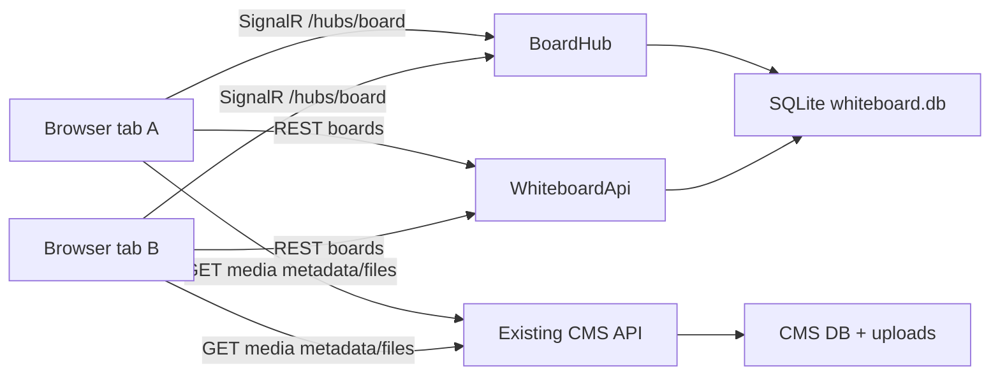

# Collaborative Whiteboard Overview

## Goal

Local demo application where multiple browser tabs edit the same infinite canvas in real time. The app has no accounts, no login, and no authorization. Anyone with the URL can edit.

The base whiteboard spec is extended with CMS pictures: users can query existing CMS media and place image references on the canvas. Whiteboard owns placement metadata only; CMS remains the source for image metadata and file bytes.

## Architecture

## Components

- `canvas-backend/src/Whiteboard.Domain`: entities, enums, DTO contracts, validation-friendly shape model.
- `canvas-backend/src/Whiteboard.Infrastructure`: EF Core SQLite `WhiteboardDbContext`, migrations, seeding.
- `canvas-backend/src/Whiteboard.Api`: Minimal APIs, SignalR hub, CORS, startup migration/seed.
- `canvas-frontend`: React 18 app with Webpack 5, Zustand store, Canvas 2D renderer, SignalR client, CMS picture picker.
- `backend`: CMS API that owns media metadata and file bytes.
- `frontend`: CMS media gallery and upload UI.

## Data Ownership

- Whiteboard persists boards and shapes in the `canvas-backend` SQLite database.
- Cursor positions, selections, and presence are in-memory only.
- CMS picture bytes are not copied into the whiteboard database. Image shapes store `MediaId`, `ImageUrl`, and `AltText`.

## Runtime Defaults

- Whiteboard API: `http://localhost:8080`
- Frontend: `http://localhost:3000`
- SignalR hub: `http://localhost:8080/hubs/board`
- CMS API for pictures: `REACT_APP_CMS_API_URL`, defaulting to same-origin `/api/media` routes in Kubernetes.

## Fitness Functions

- `dotnet build canvas-backend/Whiteboard.sln -warnaserror` succeeds.
- `dotnet test canvas-backend/Whiteboard.sln --configuration Release` succeeds.
- `cd canvas-frontend && npm run typecheck && npm test -- --watchAll=false && npm run build` succeeds.
- `cd canvas-frontend && npx playwright test --project=chromium` succeeds for collaboration acceptance.
