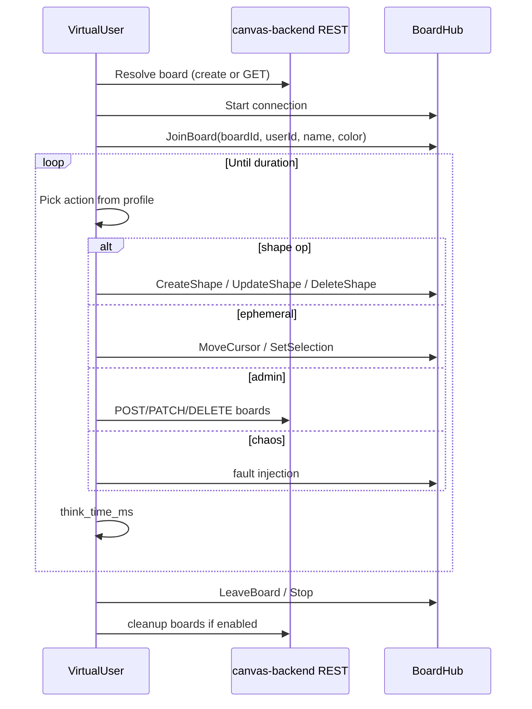

# Canvas Load Generator Component Contract (Protocol — Deprecated v1)

> **v1 implementation uses the browser:** [canvas-load-generator-browser.md](canvas-load-generator-browser.md)

## Purpose

Synthetic multi-user client for the canvas-backend REST and SignalR surfaces. Drives configurable behavior profiles to stress persistence, hub fan-out, and presence lifecycle. Not a browser; does not load canvas-frontend or CMS media in v1.

## Dependencies

| Direction | Target | Usage |
|---|---|---|
| Outbound | `canvas-backend` `GET/POST/PATCH/DELETE /api/boards` | Board lifecycle, seed reads |
| Outbound | `canvas-backend` `HubConnection` → `/hubs/board` | All realtime profiles |
| Inbound | None (batch worker) | — |
| Optional | Prometheus scraper | Pull `/metrics` on generator pod |

## Public interface (process)

### CLI

```
canvas-load --config <path> [--scenario smoke|stress|chaos] [--dry-run]
```

| Flag / env | Description |
|---|---|
| `--config` | YAML path (required unless env-only) |
| `--scenario` | Named preset overlay on YAML (`smoke`, `stress`, `chaos`) |
| `--dry-run` | Parse config, print effective plan, exit 0 |
| `CANVAS_LOAD__ApiBaseUrl` | e.g. `http://canvas-backend:8080` |
| `CANVAS_LOAD__HubUrl` | Default `{ApiBaseUrl}/hubs/board` |
| `CANVAS_LOAD__RunId` | Correlation id for logs/metrics (auto-UUID if unset) |

### Health (generator pod)

- `GET /healthz` → 200 while running or idle between runs
- `GET /metrics` → Prometheus text format

## Configuration schema (YAML)

```yaml
run:
  duration: 5m              # ISO-8601 duration or Go-style: 5m, 1h
  ramp_up: 30s              # linear spawn users
  ramp_down: 10s
  scenario: stress          # optional preset name
  seed: 42                  # deterministic RNG for shapes/positions
  cleanup: true             # DELETE boards matching prefix on exit

target:
  api_base_url: http://canvas-backend:8080
  hub_url: null             # default: {api_base_url}/hubs/board
  transport: auto           # auto | websockets | longpolling

users:
  count: 50
  think_time_ms: 100        # idle delay between profile actions (per user)

boards:
  mode: shared              # shared | per_user | pool
  shared_board_id: null     # if null, create "loadgen-{runId}"
  pool_size: 5              # when mode=pool
  name_prefix: loadgen
  precreate_shapes: 0       # optional bloat for GET payload tests

profiles:
  mix:
    lurker: 0.40
    active_drawer: 0.20
    collaborator: 0.35
    admin: 0.05
  active_drawer:
    create_interval_ms: 500
    update_interval_ms: 300
    shape_types: [Rectangle, Ellipse, Sticky]
    max_shapes_per_user: 200
  collaborator:
    cursor_interval_ms: 33    # match UI throttle ceiling
    selection_interval_ms: 2000
    update_interval_ms: 1000
  lurker:
    cursor_interval_ms: 500
  admin:
    create_board_every_s: 30
    delete_board_probability: 0.1

chaos:
  enabled: false
  reconnect_probability: 0.05
  skip_join_probability: 0.02
  invalid_board_probability: 0.01
  concurrent_update_same_shape: true

abort:
  warmup: 15s
  error_rate_threshold: 0.05    # hub+rest errors / attempts
  max_consecutive_hub_errors: 50

report:
  path: /reports/summary.json
```

### Scenario presets (overlay)

| Preset | Overrides |
|---|---|
| `smoke` | `users.count: 10`, `duration: 60s`, `chaos.enabled: false` |
| `stress` | `users.count: 100`, `duration: 10m`, `profiles.mix` as above |
| `chaos` | `chaos.enabled: true`, `users.count: 30`, `duration: 5m`, lower `abort.error_rate_threshold` disabled for fault injection runs |

Environment variables mirror YAML keys using `__` separator (ASP.NET configuration style).

## Virtual user lifecycle



## Data contracts

### Identity (per virtual user)

```json
{
  "userId": "guid",
  "displayName": "load-user-042",
  "color": "#2563eb"
}
```

Generated deterministically from `run.seed` + user index unless overridden.

### ShapeDto (hub)

Must match [whiteboard-api.md](whiteboard-api.md). Generator sets:

- `id`: new `Guid` on create; stable on update
- `type`: from profile `shape_types`
- `boardId`: target board
- Geometry: random within canvas bounds `[0, 4000]` (configurable)
- `zIndex`: monotonic per user
- `mediaId` / `imageUrl`: **omit in v1** (no CMS coupling)

Server ignores client `updatedAt`; generator may send `null` or omit.

### REST

| Call | Body | Success |
|---|---|---|
| `POST /api/boards` | `{ "name": "loadgen-..." }` | 201 + `{ id, name }` |
| `GET /api/boards/{id}` | — | 200 + detail with shapes |
| `PATCH /api/boards/{id}` | `{ "name": "..." }` | 204 |
| `DELETE /api/boards/{id}` | — | 204 |

## Profile behavior specification

### lurker

1. `JoinBoard`
2. Loop: sleep `think_time_ms`; 10% chance `MoveCursor` at `cursor_interval_ms`
3. No shape mutations
4. `LeaveBoard` on shutdown

### active_drawer

1. `JoinBoard`
2. Loop: `CreateShape` until `max_shapes_per_user`; then random `UpdateShape` / occasional `DeleteShape`
3. Intervals: `create_interval_ms`, `update_interval_ms`

### collaborator

1. `JoinBoard` on **shared** board (required for fan-out)
2. Loop: `MoveCursor` every `cursor_interval_ms`; `SetSelection` on random subset of visible shape ids; sparse `UpdateShape`

### admin

1. Mostly REST: create boards, rename, list, delete with `delete_board_probability`
2. Optional single hub connection for sanity — not required

### chaos

Weighted faults (only when `chaos.enabled`):

| Action | Expected server response |
|---|---|
| Invoke hub before `JoinBoard` | `HubException`: not joined |
| `CreateShape` on missing board | `HubException`: Board not found |
| `UpdateShape` / `DeleteShape` missing shape | `HubException`: Shape not found |
| Stop connection without `LeaveBoard` | `PresenceLeft` via `OnDisconnectedAsync` |
| Rapid `Start`/`Stop` | Connection errors counted, host stays up |
| N users `UpdateShape` same id | Last-write-wins; no server error |

## Error modes

| Condition | Generator behavior |
|---|---|
| Hub `HubException` | Count `hub_errors`; continue unless abort threshold |
| REST 4xx/5xx | Count `rest_errors`; admin profile may expect 400 on bad name |
| Connection lost | Profile `chaos` may retry; others: reconnect with backoff max 3 |
| Abort threshold exceeded | Stop spawning; drain users; exit code **2** |
| Config invalid | Exit code **1** before connections |

## Metrics (Prometheus)

| Metric | Labels | Description |
|---|---|---|
| `canvas_load_users_active` | — | Gauge |
| `canvas_load_hub_invocations_total` | `method` | Counter |
| `canvas_load_hub_errors_total` | `method`, `error_type` | Counter |
| `canvas_load_hub_invoke_duration_seconds` | `method` | Histogram |
| `canvas_load_rest_requests_total` | `route`, `status` | Counter |
| `canvas_load_boards_created_total` | — | Counter |
| `canvas_load_run_info` | `run_id`, `scenario` | Gauge = 1 for duration |

## Fitness functions

| Function | Command / check |
|---|---|
| Config parse | `dotnet test loadgen/canvas-load/CanvasLoad.Tests` — config fixtures exit 0 |
| Smoke load (local) | `canvas-load --scenario smoke` against running canvas-backend; exit 0; error rate < 5% |
| Smoke load (CI) | Same with `Testcontainers` or service URL from workflow |
| No prod leak | K8s Job not in default `kustomization.yaml`; requires explicit `kubectl apply -f k8s/canvas-load-job.yaml` |
| Cleanup | After run, `GET /api/boards` has zero names matching `loadgen*` when `cleanup: true` |

## Contract tests

Capture failing hub payloads from stress runs into `CanvasLoad.Tests/Fixtures/hub/` as JSON; assert deserializer accepts them (schema drift gate). Mirror `BoardHubTests` golden shapes for happy path.

## v1 exclusions

Documented in ADR-002; not part of this contract:

- Browser / Playwright / canvas-frontend HTTP
- CMS `/api/media` traffic
- k6 scripts
- Multi-pod canvas-backend / sticky sessions
- Auth headers or tenant isolation
- CRDT / conflict detection validation beyond LWW observation
