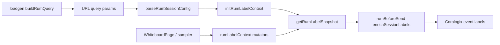

# Canvas RUM Session Labels (Component Contract)

## Purpose

Define the **ten standard Coralogix RUM event labels** for canvas load-test and demo sessions, their sources (loadgen URL vs frontend runtime), string coercion rules, and the file-level changes required in `canvas-frontend` and `loadgen/canvas-load`.

Decision record: [ADR-008](../adr/ADR-008-rum-standard-session-labels.md).

## Label pipeline (unchanged shape)



## Public interface

### Extended snapshot (`canvas-frontend`)

```typescript
// rumLabelContext.ts
interface RumLabelSnapshot {
  plan: string;
  userRole: string;
  feature_area: string;
  releaseRing: string;
  boardId_hash: string;
  widgetCount: string;
  isCollaborativeSession: string;   // "true" | "false"
  integrationContext: string;
  network_effective_type: string;
  memoryUsage_mb: string;
  // existing demo labels unchanged:
  rum_scenario: string;
  batch_id: string;
  demo_geo: string;
  demo_browser_family: string;
  path_class: string;
}

function initRumLabelContext(config: RumSessionConfig): void;
function setBoardIdHash(boardId: string): void;
function setCollaborativeSession(active: boolean): void;
function setIntegrationContext(value: string): void;
function setWidgetCount(count: number, force?: boolean): void;
function refreshNetworkEffectiveType(): void;
function refreshMemoryUsageMb(): void;
function getRumLabelSnapshot(): RumLabelSnapshot;
```

```typescript
// rumSessionConfig.ts — new optional URL fields
interface RumSessionConfig {
  // ...existing
  integrationContext?: string;       // integration_context query param
  collabOverride?: boolean;          // collab=1|0 — test override only
}

function parseIntegrationContext(params): string;  // default whiteboard_only
```

```typescript
// rumUserContext.ts
function extractUserRole(config: RumSessionConfig): string;  // viewer | editor | admin
```

```typescript
// rumRuntimeMetrics.ts (new)
function startRumRuntimeMetricsSampling(): () => void;  // 5s memory, 30s network; call from initializeCoralogixRum
```

### Loadgen query builder

```typescript
// buildRumQuery.ts
interface RumSessionAssignment {
  // ...existing
  integrationContext?: string;
  widgetCountSeed?: number;   // optional; mirrors FE widgetCount param
}

function buildRumQuery(assignment: RumSessionAssignment): string;
// Adds: integration_context, widgetCount when set
// userRole NOT duplicated — remains in rum_user.user_metadata.role
```

```typescript
// VirtualBrowserUser.ts — profile → integrationContext map
const PROFILE_INTEGRATION_CONTEXT: Record<string, string> = {
  lurker: 'whiteboard_only',
  active_drawer: 'whiteboard_only',
  text_editor: 'whiteboard_only',
  collaborator: 'whiteboard_only',
  complex_placer: 'whiteboard_only',
  media_placer: 'cms_media',
  admin: 'admin_api',
  chaos: 'whiteboard_only'
};
```

## Data contract

| Label | Type (emitted) | Loadgen URL param | Frontend source | Omit when empty? |
|---|---|---|---|---|
| `plan` | string enum | `plan` | `RumSessionConfig.plan` | No — default `free` |
| `userRole` | string enum | via `rum_user` JSON | `rumUserContext.user_metadata.role` → snapshot | No — default `viewer` |
| `feature_area` | string | `feature_area`, `area` | `RumSessionConfig.featureArea` | No — default `board` |
| `releaseRing` | string enum | `ring`, `releaseRing` | `RumSessionConfig.releaseRing` | No — default `stable` |
| `boardId_hash` | string (12 hex) | — | SHA-256 truncate on board load | **Yes** — omit if not on board |
| `widgetCount` | string integer | `widgetCount` (seed) | Live shape count | No — `"0"` |
| `isCollaborativeSession` | `"true"`\|`"false"` | `collab` (override) | `presence.length >= 2` | No |
| `integrationContext` | string | `integration_context` | URL + profile map | No — default `whiteboard_only` |
| `network_effective_type` | string | — | `navigator.connection?.effectiveType` | No — `unknown` |
| `memoryUsage_mb` | string integer | — | `performance.memory.usedJSHeapSize / 1048576` | **Yes** until first sample |

### Enum values (v1 — demo taxonomy)

| Label | Allowed values |
|---|---|
| `plan` | `free`, `enterprise`, `team` |
| `userRole` | `viewer`, `editor`, `admin` |
| `releaseRing` | `stable`, `canary`, `internal` |
| `integrationContext` | `whiteboard_only`, `cms_media`, `admin_api` (+ extensible via YAML) |

Product-spec aliases deferred to ADR-008 Phase 2.

### beforeSend merge rules

```typescript
// rumBeforeSend.ts enrichSessionLabels — required keys always set
event.labels = {
  ...event.labels,
  plan, userRole, feature_area, releaseRing, widgetCount,
  isCollaborativeSession, integrationContext, network_effective_type,
  ...(boardId_hash ? { boardId_hash } : {}),
  ...(memoryUsage_mb ? { memoryUsage_mb } : {}),
  // existing optional demo labels unchanged
};
```

## File change checklist

### canvas-frontend

| File | Change |
|---|---|
| `src/observability/rumSessionConfig.ts` | Parse `integration_context`, `collab`; extend `buildSessionQuery` |
| `src/observability/rumLabelContext.ts` | Extend snapshot; add mutators; wire `userRole` from config |
| `src/observability/rumBeforeSend.ts` | Merge all 10 standard labels |
| `src/observability/rumUserContext.ts` | `extractUserRole()` helper |
| `src/observability/rumRuntimeMetrics.ts` | **New** — network/memory sampling |
| `src/observability/coralogixRum.ts` | Start sampler after init; optional init-time static subset |
| `src/whiteboard/components/WhiteboardPage.tsx` | `setBoardIdHash`, presence → `setCollaborativeSession`, existing `setWidgetCount` |
| `src/observability/rumBeforeSend.test.ts` | Assert all 10 labels |
| `src/observability/rumSessionConfig.test.ts` | Parse new params |
| `src/observability/rumLabelContext.test.ts` | **New** — hash, collab, coercion |

### loadgen/canvas-load

| File | Change |
|---|---|
| `src/rum/buildRumQuery.ts` | Emit `integration_context`, optional `widgetCount` |
| `src/rum/rumSessionPlan.ts` | Optional matrix column `integrationContext` |
| `src/engine/VirtualBrowserUser.ts` | Merge profile → `integrationContext` into assignment |
| `src/config/types.ts` | Optional `integrationContext` on rum_batch matrix rows |
| `tests/rum/buildRumQuery.test.ts` | Snapshot includes new params |

**Out of scope**: `backend/`, `canvas-backend/`, CMS `frontend/`, Coralogix ingest pipeline configuration.

## Error modes

| Condition | Behavior |
|---|---|
| Invalid `plan` / `ring` in URL | Fall back to `free` / `stable` (existing parsers) |
| Missing `rum_user` | `userRole` = `viewer` |
| Board not loaded | Omit `boardId_hash`; `widgetCount` = seed or `"0"` |
| `performance.memory` unavailable | Omit `memoryUsage_mb` until unavailable permanently → label `unknown` optional |
| `collab=1` override with solo presence | Override wins (deterministic test only) |
| Non-demo session (`rumDemo` off) | Runtime labels still emitted (passive metrics); URL cohort dims absent → defaults |

## Dependencies

- Upstream: [canvas-rum-loadgen-extension.md](./canvas-rum-loadgen-extension.md), [canvas-rum-user-context.md](./canvas-rum-user-context.md), ADR-005, ADR-006, ADR-008
- Runtime: `whiteboardStore.presence`, `navigator.connection`, `performance.memory`

## Fitness functions

1. `npm test` in `canvas-frontend`: `rumBeforeSend` test asserts 10 standard label keys with string values.
2. `npm test` in `loadgen/canvas-load`: `buildRumQuery` decodes `integration_context` for `media_placer` profile assignment.
3. Manual workshop: shared-board loadgen run yields ≥30% events with `isCollaborativeSession=true` when `boards.mode=shared`.
4. Regression: golden URL in `buildRumQuery.test.ts` unchanged for existing params (additive query keys only).

## Implementation order (recommended)

1. Extend types + snapshot + `beforeSend` (empty defaults) — tests green.
2. Promote `userRole` from `rumUserContext`.
3. Wire `WhiteboardPage` (`boardId_hash`, `isCollaborativeSession`, existing widget path).
4. Add `rumRuntimeMetrics` sampler.
5. Loadgen `integration_context` + tests.
6. Update `docs/canvas-perf-rum-validation.md` DataPrime examples (follow-up).
