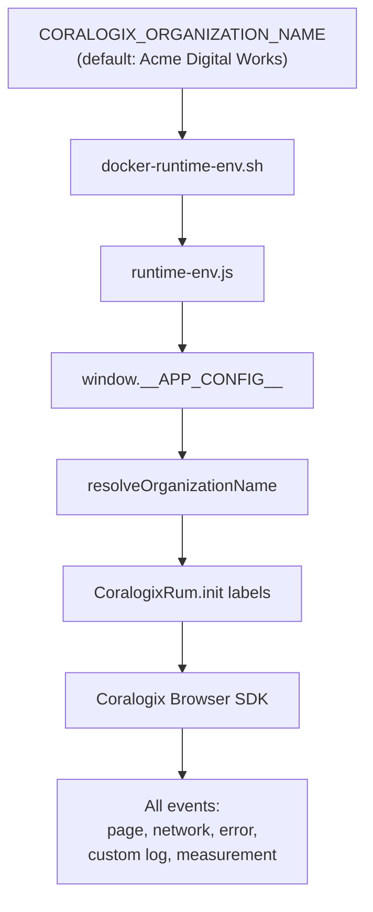

# RUM Organization Label (Component Contract)

## Purpose

Define the **`organization_name`** Coralogix RUM event label applied to all browser telemetry from `canvas-frontend` and CMS `frontend`. Deployment-static cohort dimension for DataPrime filtering across subsystems.

Decision record: [ADR-011](../adr/ADR-011-rum-organization-name-label.md).

## Label contract

| Property | Value |
|---|---|
| Label key | `organization_name` |
| Type (emitted) | `string` |
| Required | Yes — always present on every event |
| Mutable at runtime | No |
| Source | `CORALOGIX_ORGANIZATION_NAME` env → `__APP_CONFIG__` → init labels |
| Default | **`Acme Digital Works`** |
| Injection point | `CoralogixRum.init({ labels })` only |

## Public interface

### Runtime config (both frontends)

```typescript
interface RuntimeAppConfig {
  // ...existing CORALOGIX_* keys
  CORALOGIX_ORGANIZATION_NAME?: string;
}
```

### Resolver (both frontends — identical logic)

```typescript
const DEFAULT_ORGANIZATION_NAME = 'Acme Digital Works';

function resolveOrganizationName(config: RuntimeAppConfig): string;
// Returns trimmed CORALOGIX_ORGANIZATION_NAME when set and not a ${...} placeholder;
// otherwise DEFAULT_ORGANIZATION_NAME.
```

### SDK init (both frontends)

```typescript
CoralogixRum.init({
  // ...
  labels: {
    subsystem: config.CORALOGIX_SUBSYSTEM || '<frontend-default>',
    organization_name: resolveOrganizationName(config),
    // canvas-frontend also: plan, feature_area, releaseRing, rum_scenario, batch_id
  },
  // beforeSend does NOT set organization_name
});
```

## Data flow



## Error modes

| Condition | Behavior |
|---|---|
| Env unset | Default `Acme Digital Works` (shell + TS) |
| Empty string | Default `Acme Digital Works` |
| Unresolved `${CORALOGIX_ORGANIZATION_NAME}` | Default `Acme Digital Works` |
| Whitespace-only | Default `Acme Digital Works` |
| Valid override e.g. `Northwind Studio` | Emit override on all events |

Never omit label. Never fail RUM init due to org name.

## Dependencies

- Upstream: k8s deployment env (optional), nginx entrypoint `docker-runtime-env.sh`
- Downstream: Coralogix ingest (no pipeline rule required — label passes through SDK)
- Orthogonal: [canvas-rum-session-labels.md](./canvas-rum-session-labels.md) (session-dynamic labels via beforeSend)

## File change matrix

| File | canvas-frontend | CMS frontend |
|---|---|---|
| `src/observability/coralogixRum.ts` | ✓ | ✓ |
| `src/observability/coralogixRum.test.ts` | ✓ | ✓ |
| `docker-runtime-env.sh` | ✓ | ✓ |
| `public/runtime-env.template.js` | ✓ | ✓ |
| `src/observability/rumBeforeSend.ts` | ✗ | ✗ |
| `src/observability/rumLabelContext.ts` | ✗ | ✗ |

| File | k8s |
|---|---|
| `k8s/canvas-frontend-deployment.yaml` | Optional explicit env |
| `k8s/frontend-deployment.yaml` | Optional explicit env |

## Test contract

### canvas-frontend `coralogixRum.test.ts`

```typescript
// Case 1: default
initializeCoralogixRum({ CORALOGIX_RUM_PUBLIC_KEY: 'key' });
expect(CoralogixRum.init).toHaveBeenCalledWith(expect.objectContaining({
  labels: expect.objectContaining({ organization_name: 'Acme Digital Works' })
}));

// Case 2: override
initializeCoralogixRum({ CORALOGIX_RUM_PUBLIC_KEY: 'key', CORALOGIX_ORGANIZATION_NAME: 'Northwind Studio' });
// → organization_name: 'Northwind Studio'

// Case 3: placeholder
initializeCoralogixRum({ CORALOGIX_RUM_PUBLIC_KEY: 'key', CORALOGIX_ORGANIZATION_NAME: '${CORALOGIX_ORGANIZATION_NAME}' });
// → organization_name: 'Acme Digital Works'
```

CMS frontend: identical test cases.

## Fitness functions

1. `cd canvas-frontend && npm test -- coralogixRum` — init labels include `organization_name`.
2. `cd frontend && npm test -- coralogixRum` — same.
3. Manual: deploy with `CORALOGIX_ORGANIZATION_NAME=Acme Digital Works`; DataPrime filter `labels.organization_name:"Acme Digital Works"` returns events from both subsystems.

## Implementation order

1. Add resolver + init label in both `coralogixRum.ts` files.
2. Update both `docker-runtime-env.sh` + `runtime-env.template.js`.
3. Update unit tests (default, override, placeholder).
4. Optionally add k8s deployment env for documentation.
5. Run `npm test` in both frontends.
